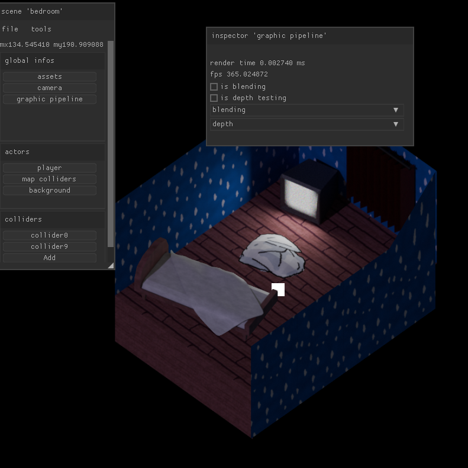

# Beauvoir
> 'Beauvoir' just like Simone de Beauvoir


## Overview
Beauvoir is an OpenGL-based game framework that aims to provide a simple, yet performant and flexible way to create 2D games - but it can also be used to create 3D games. I chose to create it in C and OpenGL ES 3.2 to keep the code simple and flexible.

The goal of the framework is to create games around layered-based scenes. You can either import images from Photoshop using ```.PSD``` files or stack images manually. 

Beauvoir can handle ```PNG```, ```PSD```, ```TIF``` and ```BMP``` through custom and fast read-only parser but more format still need to be added! It can also load simple ```OBJ``` 3d objects (```GLTF``` and ```FBX``` are still in development).

The framework is still in early development, but I'm doing my best to improve it!

## Getting Started
Beauvoir can be compiled through CMake into Makefiles and Visual Studio solutions. 

You can compile Beauvoir as a shared library and use it with your own project (Cmake templates can be find inside the demo folder). However, you can build it as a single project by using Cmake's flag ```-D BVR_MAIN_FILE=``` (e.g. ```-BVR_MAIN_FILE='demo/image_viewer.c'```) to define your own main file.

### Building for Windows
To generate Makefiles on Windows, you can run 
```cmake -G="MinGW Makefiles" -B build -D BVR_MAIN_FILE='demo/empty_game.c'```. 

To generate Visual Studio solutions, use 
```cmake -G="Visual Studio 17 2022" -B build -D BVR_MAIN_FILE='demo/empty_game.c'```. Then, open the generated ```.sln``` file or build using ```cmake --build build --config Release```. After that, link the binaries inside Visual Studio.

### Binaries
Precompiled Windows x64 binaries can be found in the [Bin](/bin/) directory. But you can build you own binaries and libraries by using the ```build.sh``` or ```build.bat``` files.

You can define your own CMake build target and compiler by changing "BVR_GENERATOR" and "BVR_CC" (or "BVR_CXX") variables in either of those files.

### Example
```C
/* include all Beauvoir's headers */
#include <BVR/bvr.h>

/* game's context */
static bvr_book_t book;

int main(){
    /* create initial game's context */
    bvr_create_book(&book);
    bvr_create_page(&book.page, "empty");

    /* create the window */
    bvr_create_window(&book.window, 800, 800, "Window", 0);
    
    /* create an audio stream */
    bvr_create_audio_stream(&book.audio, BVR_DEFAULT_SAMPLE_RATE, BVR_DEFAULT_AUDIO_BUFFER_SIZE);

    /* main loop */
    while (1)
    {
        /* ask Beauvoir to prepare a new frame */
        bvr_new_frame(&book);

        /* quit the main loop if Beauvoir is not running */
        if(!bvr_is_awake(&book)){
            break;
        }

        /* update colliders and physics */
        bvr_update(&book);

        /* push Beauvoir's graphics to the window */
        bvr_render(&book);
    }
    
    /* free */
    bvr_destroy_book(&book);

    return 0;
}
```
> You can find other demos in the [Demo](/demo/) folder.

## Third Party 
You can find submodules in the [Extern](/extern/) folder.
- [SDL](https://github.com/libsdl-org/SDL)
- [GLAD](https://glad.dav1d.de/)
- [PortAudio](https://github.com/PortAudio/portaudio)
- [Zlib](https://github.com/madler/zlib)
- [Nuklear](https://github.com/vurtun/nuklear)
- [Libpng16](https://github.com/pnggroup/libpng)
- [Json-c](https://github.com/json-c/json-c)
- [Linmath](https://github.com/datenwolf/linmath.h)